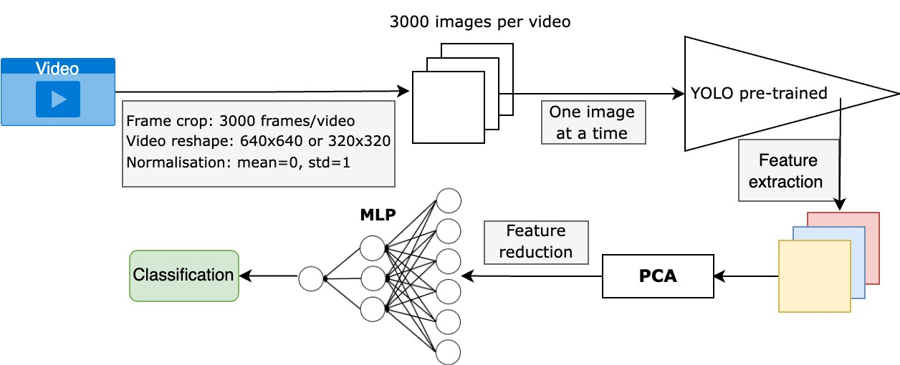

# OSS Challenge Approach for 2024
Team Algoritmi's attempt at [this challenge](https://www.synapse.org/Synapse:syn54123724), which achieved the 4th place.

Synapse project:

# Abstract
Use of YOLO for feature extraction and a multilayer percep-
tron network for classification of surgeons’ skills in open suturing.
#### Keywords: Surgery · Skill Evaluation · YOLO · MLP · Regression

# Task 1 pipeline

# If you find our work useful, please consider to ⭐️ **this repository**.
