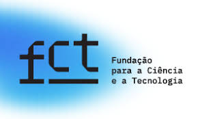
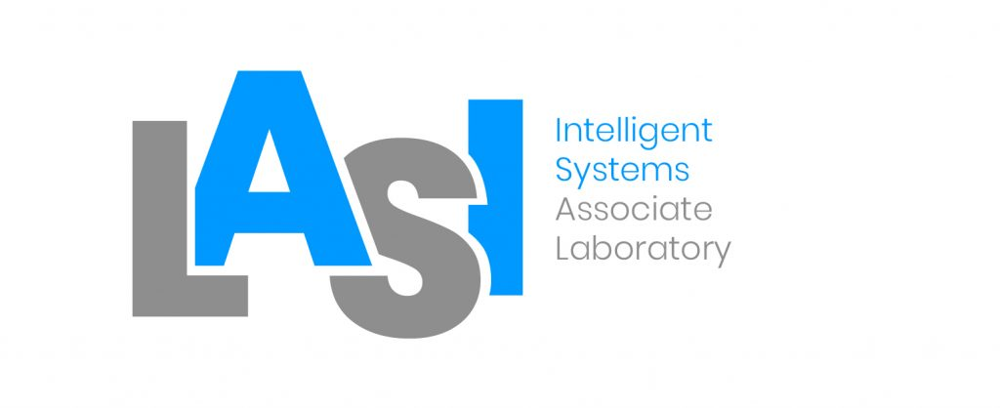
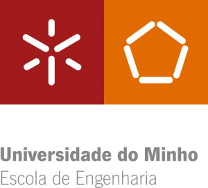

# Team Algoritmi's OSS Challenge Approach
Team Algoritmi's attempt at the Open Suturing Skills Challenge.

Versions attended:
- [2024](https://www.synapse.org/Synapse:syn54123724), which achieved the 4th place.

- [2025](https://www.synapse.org/Synapse:syn66256386).

<!---
#https://github.com/openUC2/UC2-GIT/issues/44

-->

<!---

-->
